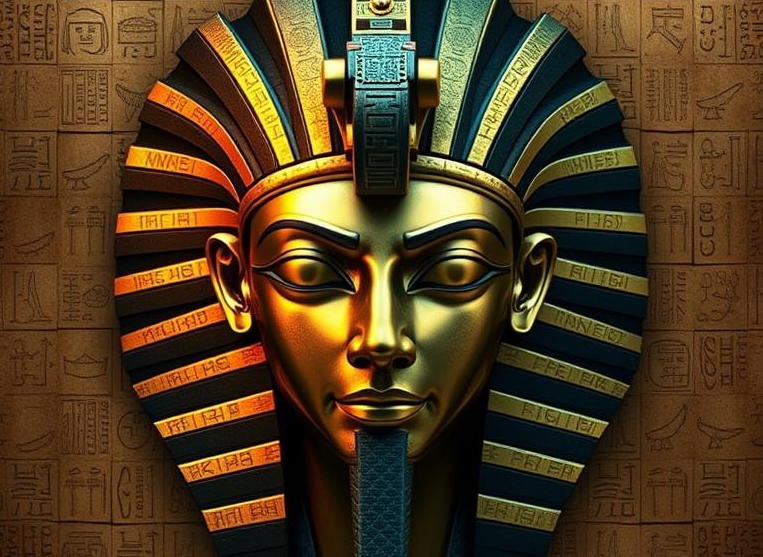

# Storage of Ancient Egyptian Artifacts (IDOR, 100p)

Hi and welcome to my first ever CTF write-up! 

I'm fairly new to the CTF concept, even though I did some CTFs around ten years ago when I studied a couple of university courses in IT security and forensics.

This challenge was part of the **Outpost24 CTF 2025**, and even if the competition is way past deadline, the challenges were still open to the public so I had a go. I tackled it solo, although I did prompt ChatGPT a few times – first to understand what IDOR was all about, and later for brainstorming when I felt stuck.

Happy reading! 🎉

## 🏁 Introduction and Challenge Overview

The challenge, **Storage of Ancient Egyptian Artifacts**, focuses on the concept of **IDOR (Insecure Direct Object Reference)** and I got to know that **Burp Suite** or equivalent was needed. From the landing page, I gathered that this challenge involved some kind of artifact collection with **restricted access** to certain items. Oh, did someone say *restricted*? 😏


I assumed the flag would be hidden among those harder-to-access artifacts. 🏳‍🌈

## 🔐 Logging In

Upon entering the "tomb" I was greeted by a login page.  
Credentials were conveniently listed right below, so why not try them? 👨‍💻


## 🧭 Logged in as Explorer

After logging in, I was told I was logged in as **Explorer** and a gallery of Egyptian artifacts appeared. I could click on the items to read facts, but no obvious clues were in sight – neither in plain text nor when having a look in dev tools. 🥱


In the footer, there was a **View Profile** link. The profile page revealed:

- **Username:** Explorer
- **Role:** Basic
- **Clearance level:** 1

This gave me *basic access to public artifacts*. Yawn... Time to aim higher.

## 🕵️‍♂️ Digging into the Login Page

I logged out and revisited the login page and had a look in dev tools. I almost immediately found a very kind clue in a comment in the code. Right below the username/password fields, I noticed a **hidden input field**.


Since this is my fist time tinkering around with IDOR, I prompted ChatGPT on how I could use this information. Having a closer look in the source code I saw that the hidden field had a `value` attribute set to an empty string. 

```html
<!-- Hidden field for the IDOR vulnerability -->
<input type="hidden" id="user_id" name="user_id" value="">
```

Since *Explorer* had clearance level 1, I tried setting the value to `2`, then I logged in again using the same credentials as before. This time, I was welcomed as **Curator**. Fancy fancy 🙂

On the profile page, I now saw:

- **Username:** Curator
- **Role:** Staff
- **Clearance level:** 2  

It also told me I had *access to staff-only artifacts and research notes*. But nothing new appeared in the gallery. Sure, I had a higher clearance level, but I had a hunch: there must be a more privileged user...

## 👑 King of the Castle. Or Pyramid?

Back at the login page, I changed the hidden field's value to `3`. Success! I was now logged in as **Director**. Now we're talking 😎

My profile now showed:

- **Username:** Director
- **Role:** Admin
- **Clearance level:** 3  

I was also told I could access *ALL RESTRICTED ARTIFACTS IN THE COLLECTION* 🤯 There was also a security note at the bottom of the page reminding me of using the correct **artifact ID** for *sensitive items*.


Hm, artifact ID... 🤔 

## 🔎 Artifact IDs in the URL

Aha! I remembered that each artifact had an **ID in the bottom right corner**, which also appeared as part of the **URL** when viewing it: `../artifact/c4ca4238a0b923820dcc509a6f75849b`


My go-to move: use the artifact ID found on the admin profile page in the URL. Thus trying to manually access a hidden page: `../artifact/a7f39e1cb8d542b6c9184b8374fe36a1`

Boom. It worked. I found **The Mask of Osiris** and **the flag**.



## 🧩 Only Half the Flag?!

I thought that was it… but I only got **half a flag**.


Until now, the journey had been pretty straighforward:

✔️ Logged in with clearance level 1  
✔️ Found the hidden input field  
✔️ Escalated to levels 2 and 3  
✔️ Located an admin-only artifact  
✔️ Retrieved the flag. Well, half of it.

But where’s the first half? If the CTF challenge was about IDOR, where could the first part of the flag be? Somewhere else when logged in as Director? Or maybe somewhere at clearance level 2?

## 🕯️ Following the Clue: "Hidden Papyrus Fragment"

I can tell you, I inspected almost the entire site in dev tools and Burp for clues to where the first half of the flag could be. Looking for comments in the code, looking for hidden artifact IDs or hidden links. Without any luck.

I read the information about the hidden artifact more closely, and this one caught my eye: "It (The Mask) contains inscriptions of forbidden knowledge that complete the ritual begun in the Hidden Papyrus Fragment." The **ritual begun in the Hidden Papyrus Fragment!** That must be it! 

I had a consultation with ChatGPT as to where I could find the first half of the flag, and I explicitly prompted that there was something with the sentence mentioning the Hidden Papyrus Fragment. After some back and forth prompts I jumped into **Burp Suite** and searched for terms as:

- `hidden`
- `papyrus`
- `fragment`
- `secret`
- `flag`

No results… 😑

I was suggested to take a closer look at the artifacts IDs and maybe change a few characters in the URL to see if they lead to a hidden page. Since the IDs weren't in numerical order – they seemed to be hashed – I didn't really see any point in altering the IDs in the dark. I even tried to go to `../artifacts/hidden_papyrus_fragment`, but you can just guess where that ended up. Yup, 404 😅

## 🧠 Hash Cracking Time

Then it struck me! If the artifact IDs are **md5 hashes**, maybe I can reverse one and understand the pattern? For instance, if the artifact ID is the md5 hash of the artifact name, then getting the correct hash for *hidden papyrus fragments* would be easy peasy. 

I picked the artifact **Papyrus Scroll** with ID `8f14e45fceea167a5a36dedd4bea2543` for my first try. I fired up **John the Ripper** and luckily the wordlist did the trick. The hash came back as `7`.

Weird result? Then I tried another, which returned `5`.

Aha! There's my numerical order. The artifact IDs must be **md5 hashes of numbers**.

## 🧪 Semi-Automating the Guesswork

Instead of hashing numbers one by one in the terminal, ChatGPT helped me out with a little Python script to hash a list of strings at once. (Since I only wanted to hash numbers it would have been cleaner looping the numbers instead of hardcoding it like this, but what can I say.)

```python
import hashlib

# List of strings
words = [
    "0",
    "1",
    "2",
    "3",
    "4",
    "5",
    "6",
    "7",
    "8",
    "9",
    "10"
]

# Print each string with its MD5 hash
for word in words:
    md5_hash = hashlib.md5(word.encode()).hexdigest()
    print(f"{word} => {md5_hash}")

```

When I got the hashes I tried them manually, one by one in the browser by substituting them into the URL. I bet Burp has a neat function to automate that, but I'll learn about that later 😅

```
0 => cfcd208495d565ef66e7dff9f98764da
1 => c4ca4238a0b923820dcc509a6f75849b
2 => c81e728d9d4c2f636f067f89cc14862c
3 => eccbc87e4b5ce2fe28308fd9f2a7baf3
4 => a87ff679a2f3e71d9181a67b7542122c
5 => e4da3b7fbbce2345d7772b0674a318d5
6 => 1679091c5a880faf6fb5e6087eb1b2dc
7 => 8f14e45fceea167a5a36dedd4bea2543
8 => c9f0f895fb98ab9159f51fd0297e236d
9 => 45c48cce2e2d7fbdea1afc51c7c6ad26
10 => d3d9446802a44259755d38e6d163e820
```

I quickly got a notion that there was something going on, since the *Papyrus Scroll* had the ID correlating to number **7**, even though there were only **6** items in the gallery.

## 🏺 The Anubis Scepter

Guess what? When I tested the hash/artifact ID correlating to number **6**, a hidden page loaded.

There it was, **The Anubis Scepter**.  And with it – **the first half of the flag**! 🥳


## ✅ Mission Accomplished

Me:

✨ Learned about **IDOR**  
✨ Took my first real steps using **Burp Suite**  
✨ Gave the task some serious amout of thinking  
✨ Cracked some **hashes**  
✨ Discovered **hidden artifacts**  
✨ Finally captured the flag. **The whole flag** 🏳‍🌈

`O24{0s1r1s_m45k_r3v34ls_th3_truth}`

Thanks for reading!

