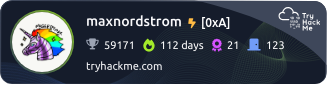

# Rooms @ TryHackMe

  
*Badge generated 2025-10-14*

A collection of writeups on rooms at TryHackMe. I try to clear as many rooms as possible and I do writeups on a few selected ones I think are extra interesting. Check out my profile [here](https://tryhackme.com/p/maxnordstrom).

## Table of Contents

- [Operation Coldstart](operation_coldstart) (2026-06-01)
- [Operation Promotion](operation_promotion) (2026-05-26)
- [Checkmate](checkmate) (2026-05-19)
- [Include](include) (2026-05-06)
- [What's Your Name?](whats_your_name) (2026-05-03)
- [Jurassic Park](jurassic_park) (2026-04-27)
- [Dev Diaries](dev_diaries) (2026-04-27)
- [Fowsniff CTF](fowsniff_ctf) (2026-04-27)
- [Injecticts](injectics) (2026-04-26)
- [Operation Takeover](operation_takeover) (2026-04-10)
- [Have a Break](have_a_break) (2026-04-06)
- [Grep](grep) (2026-03-28)
- [Order](order) (2026-02-27)
- [Mr. Phisher](mr_phisher) (2026-02-26)
- [Confidential](confidential) (2026-02-26)
- [Wgel CTF](wgel_ctf) (2026-02-24)
- [Year of the Rabbit](year_of_the_rabbit) (2026-02-04)
- [AoC Day 9, A Cracking Christmas](aoc_day9_a_cracking_christmas) (2025-12-09)
- [The Greenholt Phish](the_greenholt_phish) (2025-11-25)
- [Team](team) (2025-11-11)
- [Simple CTF](simple_ctf) (2025-10-17)
- [CTF Collection Vol 1](ctf_collection_vol_1) (2025-10-14)
- [Basic Pentesting](basic_pentesting) (2025-09-16)
- [Capstone Challenge](capstone_challenge) (2025-08-31)
- [Pickle Rick](pickle_rick) (2025-08-21)
- [TakeOver](takeover) (2025-08-13)
- [Upload Vulnerabilities](upload_vulnerabilities) (2025-07-29)
- [File Inclusion](file_inclusion) (2025-07-07)
