# Basic Pentesting

  
> 🐱‍💻 Try out the room @ [https://tryhackme.com/room/basicpentestingjt](https://tryhackme.com/room/basicpentestingjt)

## 📋 Introduction

This is a writeup of the room Basic Pentesting. You could see it as a Black Box pentesting since we were basically only given an IP address, but maybe it should be called Grey Box as we also had a series of questions to work from which in some ways revealed what we were looking for. I did the task together with a friend, [onind00](https://tryhackme.com/p/onind00), which was very fun since we could help each other out and learn from one another.

The room consisted of quite a lot of questions and I will not present the answer to all of them. Instead, I will write a coherent text that ultimately leads to how we found the answer to the final question. The final question was:

> What is the final password you obtain?

## 🗺️🧭 Initial Recon

Since we only had an IP address, I started by running an nmap scan to find out which open ports existed and what services they were running.

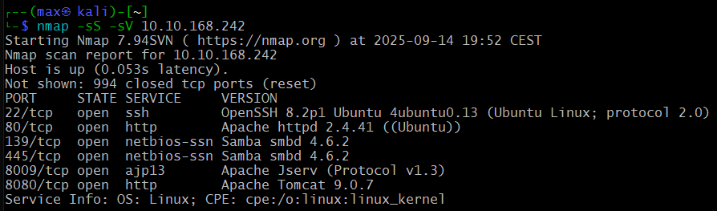

As we can see, there were some interesting open ports, including SSH, HTTP, and SMB. SMB was particularly interesting because it is associated with various vulnerabilities, but let's start by looking at port 80. I opened the browser, entered the IP address, and found this nice little website:

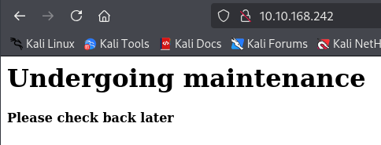

This hinted that there could be more pages to discover. I checked the source and found a comment prompting us to look for development notes. Time to look for more paths. I fired up Gobuster and got a hit fairly quickly.

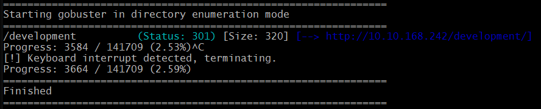

I let Gobuster run through the entire list but didn't find any other paths. At `/development` there were links to two different text files with the following contents:

The first one called `dev.txt`  
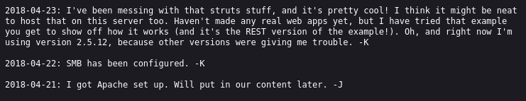

And a second one called `j.txt`  
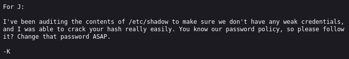

The texts seemed to contain communication between some people calling themselves J and K. One could assume those were the first letters of their names. In one of the texts it also said that Apache and SMB were running, which we had already confirmed with our nmap scan. Extra interesting was the message that seemed to suggest that K was using a weak password. Hopefully, we would be able to exploit that later.

## ⏳ Keep on Enumerating

Since we didn't find any obvious way in via the website, we decided to look further. I ran `enum4linux` against the IP address to see what I could find. Something that was especially interesting was the list of users - there were two names that matched what we had found on the website, namely `kay` and `jan`.

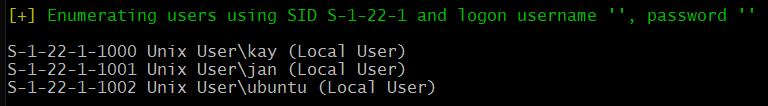

I also checked what shares there were via SMB and found one called `Anonymous`.

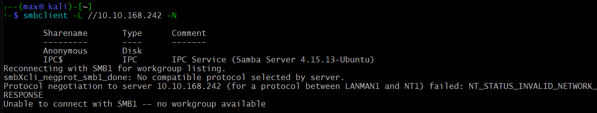

I connected to the Anonymous share, and there was a text file named `staff.txt`. Unfortunately, it contained nothing more than yet another message between Kay and Jan.

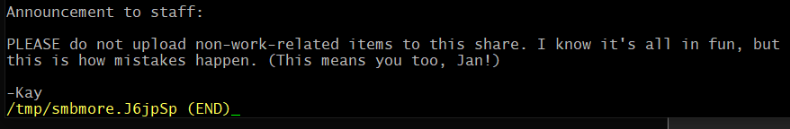

## 🔒 Two Semi-fails in a Row

We made two attack attempts that didn't really lead anywhere, so I won't describe them in detail, but I still want to mention our thought process.

The first was to try cracking the SMB passwords for the users Kay and Jan. We succeeded, but we couldn't find any additional shares. It was a dead end.

The second thing we tried was getting in via Tomcat since our nmap scan had shown that port 8080 was open and running said service. We tried to brute-force the login there without any luck. Time to think further.

## Port 2️⃣2️⃣

We had seen that port 22 was open and we knew that the users Kay and Jan existed on the system. So it was time to try brute-forcing the SSH login. I started Hydra and fairly quickly got a hit on the user `jan`.

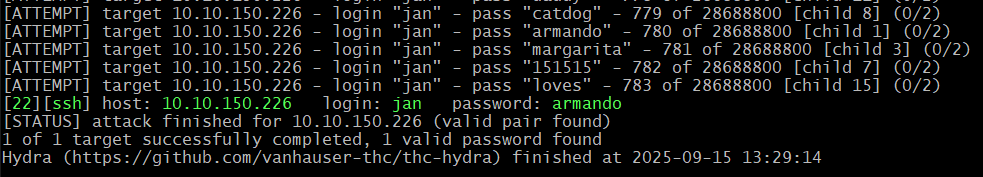

We logged in as jan and started looking around the system. What we were looking for were interesting files and privilege escalation vectors. We could quickly conclude that jan was a normal user without any significant privileges. I therefore began investigating whether there were any binary files with **the s bit set**, but unfortunately there were none I could exploit. The only one present was `pkexec`, but that required being able to run it with sudo.

By running the command `getent group sudo`, however, we could confirm that the user `kay` had sudo privileges:

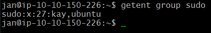

We looked in kay's home folder, and there were several interesting things, including a file named `pass.bak` and a couple of folders, among them `.ssh`. When I tried to print the contents of `pass.bak`, I unfortunately got access denied, so this was at least a file we wanted to return to later.

After a closer look in `.ssh` we found nothing less than a private SSH key! And it was readable, sweet! 🥳

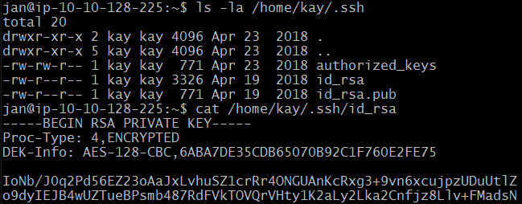

## 🔓 Cracking Time

With a bit of luck, the user `kay` would have used a weak password for the private key. We let `john` do its magic. First `ssh2john` to get a format that `john` understands, then cracking time. Was it a weak password? Oh yes.

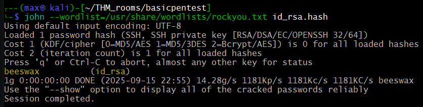

Now it was easy peasy to SSH in as `kay` with the private key and print the contents of `pass.bak`. We got our flag 🚩🎉🥳

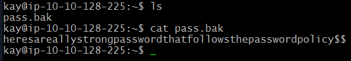

## 📝⚡ Final Thoughts

This was quite a tricky challenge since we didn't have much to go on - almost like a black box pentest. Even though it seems to have been fairly straightforward, it took us quite some time, and we explored several different paths that didn't lead anywhere. But! The fact that those steps didn't lead us straight to the answer wasn't a problem, as they gave us a deeper understanding of the system we were working with and ultimately allowed us to solve the puzzle.

Thanks for reading and happy hacking! ✨

> 16 September 2025. Original text and markdown formatting by me. Translation by AI.