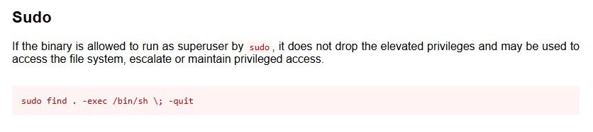

# Capstone Challenge

> ⚠️ Spoiler alert! Do you want to try out the room yourself before you read further? You'll find it at [https://tryhackme.com/room/linprivesc](https://tryhackme.com/room/linprivesc)

#### *2025-09-02*

## 📋 Introduction
This was the final task in the Linux Privilege Escalation room, and these were the conditions I had to work with:

>You have gained SSH access to a large scientific facility. Try to elevate your privileges until you are Root.

Throughout the room I learned about quite some privilege escalation vectors and now it was my task to find the suitable one/ones to get root access and retrieve the flags.

## 📡 Initial recon

In the task description I got the credentials for a normal user, `leonard`, so I SSH:ed my way to the target machine. I started out with some basic manual enumeration to get an overview of the system. I headed over to the `/home` directory to see if there was anything of interest. I found two subdirectories (apart from my own), but I didn't have the right permissons to have a look inside 😢

Based on the tasks leading up to this challenge I assumed that the flags were to be found in the home folders of `missy` and `rootflag`. (Rootflag is also a very telling name, don't you think? 😅) I figured `flag1.txt` was in missy's directory and `flag2.txt` in rootflag's, so in my mind I first had to get the privileges for another user (some horizontal escalation action) and then root access (as in vertical, the sky is the limit).

## 🚀 Time To Escalate

The first thing to check was if I could run any commands with `sudo`. I ran `sudo -l`, entered my password and got this fine message:

So that wasn't an option... But the lecture from the local System Administrator wouldn't hinder me in trying to find other ways to gain access 😅

Next up was to check if any programs had the **SUID bit** set. The thing with SUID (short for **Set-User Identification**) is that if it is set, the file is allowed to be executed with the same permissions **as the owner of the file**. In other words, if the owner of a file is `root` and the SUID bit is set, **any** user have the ability to execute that file as root. 

To determine if the SUID bit is set you essentially want to see an **s** instead of an **x** in the "owner" part when printing out the permissions. So `-rws------` instead of `-rwx------`. It'll become clear 🙂

I ran `find / -type f -perm -04000 -ls 2>/dev/null` and got a lot of output, but I actually got interested in the first result in the list, `/usr/bin/base64`. And as you can see, the permissions begin with `-rws` 👌

## 6️⃣4️⃣ Having a Closer Look at Base64

Base64 is a way of encoding binary data into plain text. This is happens around the world wide web all the time, and the `base64` command-line utility basically encodes or decodes data to/from base64 format. For instance you can run `echo hello | base64` and the output will be `aGVsbG8K` - *hello* just got encoded to base64. It can also encode the contents of a file with the basic syntax `base64 myFile.txt`. 

Now with that in mind, will `base64` with the SUID bit set let me process files otherwise out of my permissions? I headed over to [GTFO bins](https://gtfobins.github.io/) to have a look and found this neat command:

The command would take the input from the file, encode it to base64, pipe it and then directly decode and print it. Kind of like a doing a more complicated `cat` or `less` 😅

Instead of defining the flag as a variable I just put the whole path in the command and ran `base64 /home/missy/flag1.txt | base64 -d` because it was there I thought I was going to find the first flag. But no, I got the response `base64: /home/missy/flag1.txt: No such file or directory`.

So I tried my luck with the second flag instead which I thought would be found in the home directory of `rootflag`. I ran `base64 /home/rootflag/flag2.txt | base64 -d` aaaaaaand bingo 🎉

## 🤔 How to Get the First Flag

Since I didn't know the file structure in the home directory of `missy` I couldn't point the base64 command to a specific file. And guessing at random directories wouldn't be feasible. `flag1.txt` could litterally be anywhere on the file system. (In hindsight, it would indeed have been *very* feasible guessing random directories, I'll tell you later 😅)

So, was there a way to gain the privileges of the user `missy`?

Well, if `missy` had a weak password the hash would be possible to crack. I just needed to print the hash from `/etc/shadow`, and I had just the right tool for that, didn't I? 😉

I ran `base64 /etc/shadow | base64 -d` and boom, there was my hash for `missy`. And for `root` too for that matter. If the root password was something silly easy it would be really convenient. 

I created a custom text file with the hashes, fired up `hashcat` and let it run for a while. The root password was never cracked, but missy's password came back in plaintext super fast. 

Switched user to `missy` - a perfect example of horizontal escalation - and had a quick look around in the home directory and found the flag I was looking for.

As you can see it was located within the Documents directory, not a rocket-science-secret place to store a CTF flag, so having a "random" guess at that path with base64 wouldn't have been that hard 😅 

## ✅😤 Done but not Finished

I had my flags, mission accomplished, right?

I did get root file read via `base64`, but could I leave this room without getting a root shell? I wasn't satisfied... I wanted, as they say, FULL PWN! 😅 

I have learned that `cronjobs` are a viable vector for privilege escalation, so I checked if my user `leonard` had any cronjobs running. Nothing. Switched back to `missy`, but it was the same. (Maybe cronjobs are defined system wide? Not really sure about that.)

It struck me that `leonard` couldn't run any commands with `sudo`, but maybe `missy` could? Jackpot, `missy` could run `find` with root privileges.

Headed over to my favourite website [GTFO bins](https://gtfobins.github.io/) again to see if `find` could do anything fun. And surprise, surprise, it seemed like `find` could drop me into a root shell 😎

A couple of keystrokes later, voilà, root shell. **FULL PWN!!** (lol, I got a bit carried away, sorry 😅) No more flags to collect, but it gave me a nice rush and a bit of confidence 🙂

## 📝 Summary

This was a fun and challenging task to sum up the Linux Privilege Escalation room. It was pretty straight forward thanks to all the things I learned throughout the room, but also gave me the opportunity to be creative. 

As a wise man once said (well, actually it was mentioned in the room), priviliege escalation is more an artform than a science. This was how I solved it, but I guess there are plenty of other ways too.
 
Thanks for reading and happy hacking! ✨