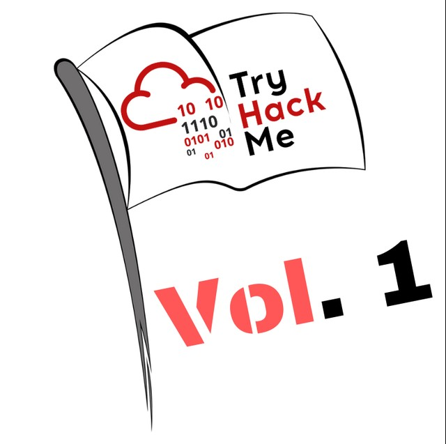
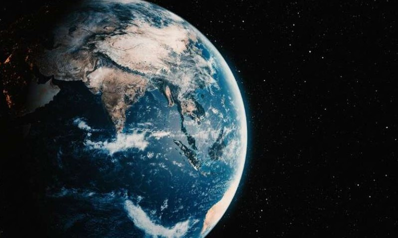
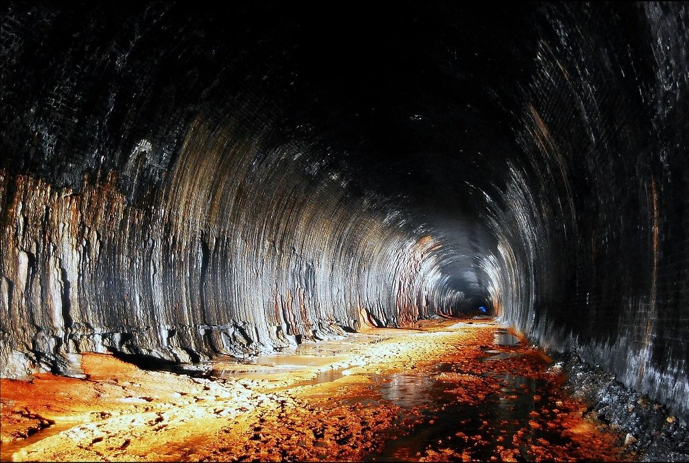

# CTF Collection Vol 1

</img>

> 🐱‍💻 Try out the room @ [tryhackme.com/room/ctfcollectionvol1](https://tryhackme.com/room/ctfcollectionvol1)

## 📋 Introduction

This writeup was originally intended as a simple personal note for myself, but I got inspired to tidy it up and publish it here. This room consisted of 20 CTF challenges, and looking back I see my writeup a bit like a roadmap for how to approach the most classic types of CTF tasks. I hope it can be useful to more than just myself 🙂 I tackled the room together with [onind00](https://tryhackme.com/p/onind00) and we had a really nice morning.

## Task 1 - Author note

A welcoming intro text. No flag here.

## Task 2 - What does the base said? 💬

The task was to decode base64. In Linux we ran `echo 'the_base64_string' | base64 -d`

## Task 3 - Meta meta

</img>

We used `exiftool` to read the metadata

## Task 4 - Mon, are we going to be okay?

We used `steghide` both to see that the file contained a hidden message, and the same tool to extract the message (no password was required, we just pressed enter).

## Task 5 - Erm... Magick 🔮

White text on a white background. We found the flag straight away since we both ran TryHackMe in dark mode, so it was actually a white block on a dark background 😅

## Task 6 - QRrrr

We were presented with a QR code which we scanned and got the flag. I used my phone, but my buddy used Linux and `zbarimg -q --raw QR_1577976698747.png`

## Task 7 - Reverse it or read it?

The file had the extension `.hello` and seemed to be some kind of binary. When I opened it in Notepad I saw a mix of mysterious characters and plain text. When I scrolled down a bit I found the flag in plain text.

## Task 8 - Another decoding stuff

We were presented with a string. It wasn't an obvious hash so we fed it into CyberChef. The string was encoded with base58.

## Task 9 - Left or right

Another string. It was encrypted with ROT13. I ran a brute force in CyberChef and got the flag. A shift of 7 was used.

## Task 10 - Make a comment

The flag was in a paragraph hidden with `style=display:none;`

## Task 11 - Can you fix it? 🛠️

We downloaded a broken png file. Read the file with `xxd` and could see that the first bytes were wrong. A valid png should start with `89 50 4E 47` so I ran `hexedit`, adjusted the initial bytes, saved and opened the file. The flag was in the middle of the image.

## Task 12 - Read it 👓

We were to find a flag somewhere on TryHackMe's social media, specifically Reddit. On Reddit we searched `r/tryhackme` and the user who created the room. We found a thread and the flag was there.

## Task 13 - Spin my head

We were presented with a rather obscure string:

```
++++++++++[>+>+++>+++++++>++++++++++<<<<-]>>>++++++++++++++.------------.+++++.>+++++++++++++++++++++++.<<++++++++++++++++++.>>-------------------.---------.++++++++++++++.++++++++++++.<++++++++++++++++++.+++++++++.<+++.+.>----.>++++.
```

My friend introduced me to the site https://www.geocachingtoolbox.com/ and there I found that the string was likely a program written in `brainfuck`

After pasting the string and running the program on geocachingtoolbox we got the flag.

## Task 14 - An exclusive!

We were presented with the strings

```
S1: 44585d6b2368737c65252166234f20626d
S2: 1010101010101010101010101010101010
```

`S1` is a hex string and `S2` is binary. We guessed we should XOR them in some way. In CyberChef we entered the first string, converted from hex, then ran XOR using the second string as the key. That produced the flag

## Task 15 - Binary walk

</img>

We were given a jpg file, and because of the task name we downloaded `binwalk`. Running the program we saw that the jpg contained another file called `hello_there.txt`. So we ran `binwalk -e filename.jpg` and extracted the text file which contained the flag.

We also discovered that we could upload the image to CyberChef and use **Scan for embedded files** or **Extract files**.

## Task 16 - Darkness

We were presented with a black image. We downloaded it and opened it with `stegsolve.jar` since we suspected it would be a classic steganography challenge. Found the flag immediately.

## Task 17 - A sounding QR 🎶

A QR code that led to SoundCloud where we could listen to a voice reading a text quite quickly. I recorded the audio with my phone, then opened the audio file in **Amazing Slow Downer** so I could hear what the flag was.

## Task 18 - Dig up the past ⛏️

We were to check the website https://www.embeddedhacker.com/ at a certain point in time. Jumped to the Wayback Machine, entered the specified time and found the flag.

## Task 19 - Uncrackable! 💥

Presented with an encrypted text and the instructions said the key was lost. My mind went to the Vigenère cipher since that that's a classic chiper that requires a key. Went to CyberChef to investigate. The sample text was far too small to reliably reverse engineer Vigenère, but we tried simple keys (like weak passwords). It wasn't `key`, but it was `thm`.

## Task 20 - Small bases

Presented with a long string of digits. Based on the task name it should be about using small bases somehow. Without success in CyberChef I used AI to create a brute-force script in Python.

```python
s = "1202212101120"  # your string
for base in range(2, 37):
    try:
        val = int(s, base)
        out = val.to_bytes((val.bit_length()+7)//8, 'big')
        if all(32 <= b < 127 for b in out):
            print(base, out)
    except:
        continue
```

When I fed it the actual string and ran it I got the flag.

## Task 21 Read the packet 📦

The final room consisted of a pcap file. I opened it with Wireshark and sorted by protocol so I could get a quick overview. An interesting HTTP GET request caught my eye. I right-clicked and chose Follow > HTTP Stream and could read the flag.

## 💭 Final Thoughts

This room really made me go into the CTF mindset throwing me new challenges in blazing speed. Had such a good time.

Thanks for reading and happy hacking! ✨

> 14 October 2025. Original text and markdown formatting by me. Translation by AI.