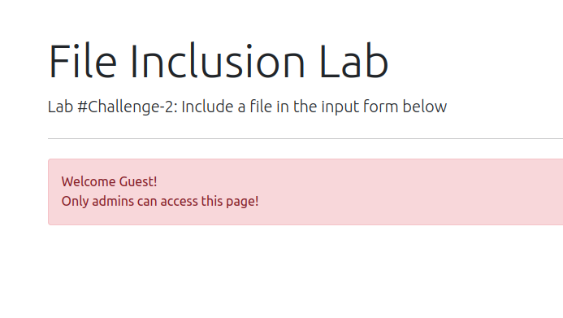
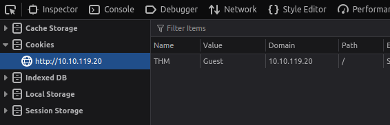
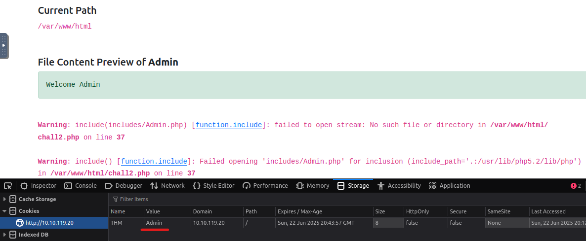
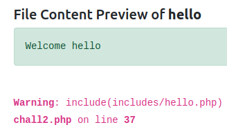
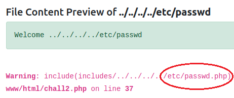
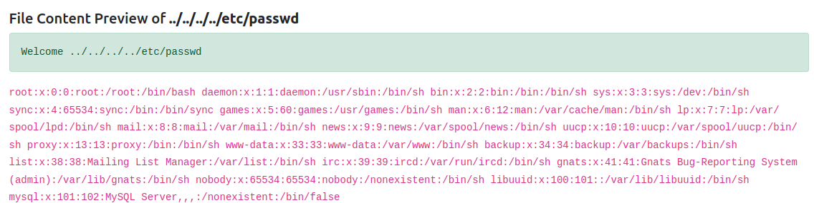
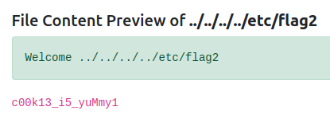

# File Inclusion Challenge #2

> ⚠️ This writeup contains spoilers for the room *File Inclusion* on Try Hack Me. I highly recommend trying the room yourself before reading further! You can find it at [https://tryhackme.com/rooms/fileinc](https://tryhackme.com/rooms/fileinc)

## 📋 Introduction

This is the second challenge in the File Inclusion Lab and all I know is that my goal is to retrieve the flag found in `/etc/flag2`. ([Here's](#) a little summary of what File Inclusion is all about.) In the tutorials and challenges leading up to this one there has always been an input field, but that doesn't seem to be the case here...

## 🔍 Starting the Investigation

When I first opened the page I was met by a message saying "Welcome Guest" and that the page was only accessible to admins. So, no visible input form to include a file in right now.

Because I didn't know where to start I checked out the hint provided by Try Hack Me, and it said that I should check my cookies. 🍪 Said and done!
I had a look in dev tools to inspect my cookies (well, first of all I had to Google in what tab of the dev tools I would find the cookies… Which is in `Storage > Cookies` by the way 🙂) and I could see that I got one cookie from the site I was visiting at the moment.

## 🍪 Tampering with the Cookie

Since `Guest` was written with a capital G I changed the value of the cookie to `Admin`, with a capital A, and reloaded the page, which got me this:

It took me past the red message box and I was now welcomed as Admin, sweet 😎 But it also gave me a couple of warning messages, so when I changed the value to `admin` with a lowercase a, it just said **Welcome admin**. A much cleaner look! But, warning messages shouldn't be overlooked, I could actually use them to my advantage. Let me show you how!

## 🕵️‍♀️ Analysing the Warning Messages

The first warning message begins with `include(includes/Admin.php)` and tells me that it's unable to open stream and that there is no such file or directory in `/var/www/html/chall2.php` This is really helpful, because it seems like the value of the cookie is being used in an `include()` function in php. Let's check out what happens if I change the value of the cookie.

As you can see, I changed the value to `hello` and now `includes/hello.php` is trying to be retrieved. Apparently, no input validation seems to be done which is really bad practice from a security point of view, but really neat for us to exploit 😈🐱‍💻

## 💥 Exploiting the Vulnerability

Let's see if LFI is possible, giving the cookie a couple of `../` instead to try and open a known file on a Linux system, let's say `/etc/passwd`. But how many directories up to I have to traverse to get to the root directory? Well, I can see that my current working directory is `/var/www/html`, and that the include function is trying to retrieve a php-file from the `includes` directory. Assuming `includes` lives within the `html` folder, there would be a total of four directories up to `root`, so let's try `../../../../etc/passwd`

Oh, that's not quite right since `passwd` isn't a php-file. So the include function doesn't only take the input value from the cookie, it also appends `.php` to it. So I need a way to get rid of the file extension to get my traversal to work. Calling AI to tell me more 📞

## 🧷 The Null Byte 

The response I got was that there are several ways to do this, and the first recommendation I got was to try out using a Null Byte. You write it as `%00` and what is does is that it tells that this is the end of the statement and executes directly, ignoring whatever comes after. This only works with older versions of PHP though (pre-5.3 to be exact). Recalling the first image in this writeup you can take a closer look at one of the error messages saying `(include_path='.:/usr/lib/php5.2/lib/php')` which tells us that PHP 5.2 is being used. Boom, let's try a Null Byte.

Changing the cookie value to `../../../../etc/passwd%00` gives me: Jackpot 💲💲💲

## 🏁 Getting the Flag

As the CTF challenge instructions say, my goal is to find the flag in `/etc/flag2`, so let's go there instead. Setting the cookie value to `../../../../etc/flag2%00` and giving it a go.

The flag has been captured, and I've learned a lot about LFI 🥳👌 Even though these exact flaws shouldn't be out in the wild today – I mean input validation and updated PHP really should be in place – it has given me some good insights on vulnerable entry points and new perspectives on how to take on a pentest task.

Thanks for reading! ✨