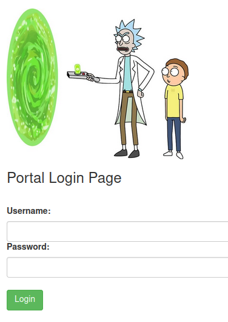
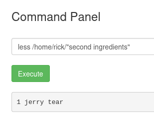

# Pickle Rick

> ⚠️ Spoiler warning! Do you want to try out the room yourself before you read further? You'll find it at [https://tryhackme.com/room/picklerick](https://tryhackme.com/room/picklerick)

#### *2025-08-21*

## 📋 Introduction
This was the final room in the **Web Fundamentals** path - a CTF challenge where I assumed I was going to face the same type of challenges presented throughout the other rooms along this path to sum it up. My assupmtion was right, but I didn't expect that it would take me such a long time to solve the CTF. Not because it was too difficult or above my knowlege level, I just did a couple of n00b mistakes, and also I was looking in the wrong places. But finally, after a couple of sessions and getting a few hints from the TryHackMe chatbot, I finally got my flags. Let's break it down.

The CTF was Rick and Morty themed and the plot was that Rick was turned into a pickle. My mission was to find the three ingredients needed to make a potion to reverse the pickle incident. To find these I needed to exploit a webserver 🐱‍💻

## 🔍 Landing Page

I headed over to the provided IP that hosted a website, and the first thing I did at the landing page was to check the page source via dev tools. The first thing to catch my eye was a comment in the code. It seemed like a forgotten note to self providing a username. 

But a username is only useful if there is a system to log in to. In the task I was only provided the one IP leading to the website, and the website didn't contain any links. It was time to go looking for a site login using some path enumeration.

## 🛰️📡 Gobuster

To find possible paths to a hidden login page I set up and ran **Gobuster**, specifying the IP and making it enumerate directory names based on the provided wordlist. After my first run I only found `/assets` and `/server-status` which was a bit disappointing because it didn't get me closer to logging in. I tried my luck with some manual enumeration, like `/admin` and `/login`. I think I even tried `/wp-admin`, maybe it was a WordPress site. But no. I also set up and tried **Ffuf** (acronym for the epic name Fuzz Faster U Fool 😅) to see if I would get a different result, but I didn't.

Then it hit me 💡 Maybe I was using the wrong wordlist? I poked around in the **SecLists** folder and understood that there was a list (actually a whole bunch of them) for **Web Content and Logins** specifically. I picked one of them (can't remember which one exactly) and set up **Gobuster** once more. Now I got some real nice hits such as `/login.php` 💥

As I mentioned, I did try `/login` manually, but I didn't append the `.php`, and `/login.php` wasn't specified in the first wordlist I used. Lessons learned? Use a tailored wordlist for the specific task you are up against 👌

## 🔑 /login.php

The next thing to do was to check the source of `/login.php` to see if I could find anything interesting. Maybe a comment, or something telling me about how the login logic worked. Best case scenario would be that the logic was handeled client-side, giving me the opportunity to alter the code. 

Couldn't find anything juicy, so I tried to log in with the username found earlier, `R1ckRul3s`, and the password `password`. That just led me to an error message saying that either the username or password was wrong - no specific details wether it was the username *or* the password that was wrong. Bummer.

## 🤔🧪 Trying Out a Bunch of Things 

- I tried to alter the login logic client-side, but I couldn't find any obvious flaws. 

- Caught the login request and sent it to **Burp Intruder** for some dictionary attacks.
    - I tried a couple of not-too-big wordlists (Since **Intruder** is throttled in the community edition) from the **SecLists** repo. 

    - I even tried some curated wordlists with a Rick & Morty theme, but that didn't work either. (In hindsight, this was actually really close to logging in...) 
- Maybe there was a way to bypass the login altogether? A SQL injection might do the trick? I tried a couple of versions of `' OR 1=1--`, both in the username and the password field, but everytime I got the same repsonse: `Invalid username or password`.
- I had a look at a cookie called `PHPSESSID`, but that one seemed totally legit without any obvious vulnerabilities to exploit.
- Since **Gobuster** found the directories such as `/?page=admin.auth.inc` I had a look to see how the webpage would respond to Local File Inclusion - you know, adding `../../../../etc/passwd` in the URL to gain access to the passwd file and such. But, every attempt just took me to the startpage.

## 🤖 Echo

There's this chatbot on TryHackMe called Echo. Until now I hadn't used it in any greater extent. It just throwed random tips my way, like "`cd` is a very good command in Linux". It just didn't give the impression that it could help me very much.

But I though to myself, hey, why not? I asked if it could point me in the right direction how to get passed the login page.

It replied: Have a look in `robots.txt`

No way? Was it that simple? Why in the name of who knows who would there be a password in the `robots.txt` file? It's just a file telling scraping search engine (and AI I suppose?) bots what files to ignore.

A quick look later. Yes, it was that easy 😅

I couldn't know for sure that `Wubbalubbadubdub` was the actual password, but it sure gave me a nice feeling to find it. I tried the  credentials to log in and it worked like a charm ✨ After logging in I was presented with a page with a bunch of links, but even more interesting, a **Command Panel** which I guessed would let me execute commands on the server.

> 📌 Quick side note! I don't know what `Wubbalubbadubdub` is, but I guess it's some kind of Rick & Morty inside-joke-kind-of-thing, and there *was* a variant of the word in my curated wordlist! Can you imagine? But it included some hyphens, or capital letters or something, so it wasn't the correct password. But so close!

## 🔐 On the Inside

The first thing I did, before trying to execute arbitrary commands, was to check the page source. And there was a really interesting comment that seemed to be encoded in **Base64**.

I decoded it, but ended up with yet another Base64-looking string. Hm... Did some quick research and decodeded the new string once more. And the new string yet another time. And again, and again, and again. Did I end up with the first flag? No. It said `rabbit hole` 😅 and actually put a smile on my face, really 😄

## 🐱‍👤 Command Panel Time

I headed over to the form saying Command Panel and first ran `pwd` and then `ls`. Found some interesting files. Unfortunately `cat` was disabled, but I opened `Sup3rS3cretPickl3Ingred.txt` in the URL and found the first flag, finally 🥳

Up next was `clue.txt`

So that's what I did!

I learned that if `cat` is disabled, there are some other commands that also will print out a file's content. I used `less` which worked just as good as `cat` for this task. After som digging around I found a file called `second ingredient` in Rick's home folder. And by using `less` I could read the content.

I carried on looking for the third flag. But I didn't really know where to look and couldn't find anything obvious.

Since there were hyperlinks in the menu pointing to `denied.php` and leading to a page saying that only the *real* Rick can access the page, I assumed there had to be a way to bypass the check. Maybe by altering the cookie or something. But after giving that a couple of tries I actually asked the bot on Tryhackme for a hint, and it told me to look in `/root`. Of course. Maybe I was a bit tired 😅 A normal `ls /root` didn't show me anything, nor a `ls -a /root`. But `sudo ls /root` did. So next up was `sudo less /root/3rd.txt`

## 📝⚡ Conclusion and Key Takeaways

This was a tough one, even if it was rated as easy and had a cheeky little "done in 30 minutes" label 😅 I've learned a lot about initial recon in a CTF challenge (like, use relevant wordlists when scanning for directories), and that the solution might be a bit more simple than one first thought (like, there *could actually* be a password in the robots.txt file). It's easy to overthink the task and make it more complicated than it has to be. But I think that my logical thinking and lessons learned from this task has made me well prepared and ready for future CTF challenges.

I want to emphasize that the key takeaway from this task for me must be the importance of using relevant and optimized wordlists while in the active recognision fase of a pentest or CTF challenge. Since I didn't really do that from the beginning it took me longer to find `/login.php`, and I didn't get any hits on `/robots.txt` during the enumeration at all. So, relevant wordlists (and also having in the back of my mind that `robots.txt` is a place to have a look) is the biggest lesson I take away from this.

Thanks for reading and happy hacking ✨