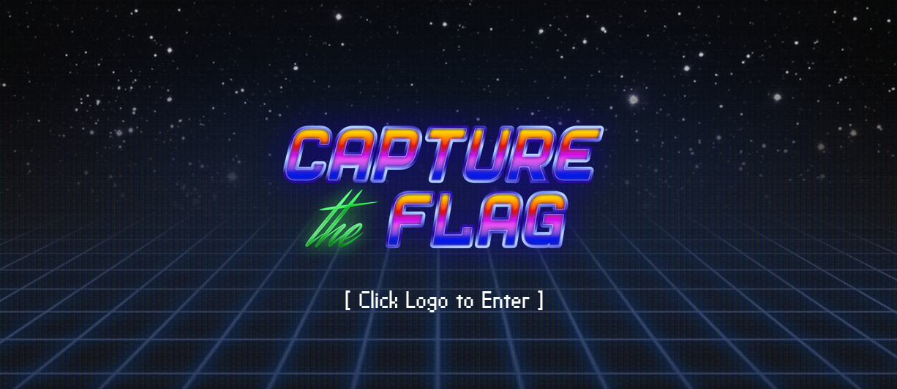

# Simple CTF

> 🐱‍💻 Try out the room @ [tryhackme.com/room/easyctf](https://tryhackme.com/room/easyctf)

## 📋 Introduction

My friend [onind00](https://tryhackme.com/p/onind00) and I have been doing CTFs quite a lot over the past months, and today we were happy to see that another friend of ours wanted to join, [HENZU](https://tryhackme.com/p/HENZU). The three of us tackled the room Simple CTF and had a really good time. When we read through the questions it seemed to live up to its name - easy as pie - but it would turn out that we still ran into a few different challenges. As usual, in other words 😅

## 🔍 Initial recon

We started out by running `nmap -sS IP-address` to check how many services were running on ports under 1000. We saw three open ports, two under 1000 and one above. Admittedly the command doesn't scan *all* ports under 1000, only the ~1000 most common ones. But it seems we found what we needed.

Ran `nmap -sS -sV IP-address` to find out which service ran on port 2222 - it was SSH. Normally port 22 is used for SSH, but this was probably some attempt at security by obscurity.

After poking around a bit on **ftp** we discovered a username: `mitch` That was my friends' find - they logged in as *anonymous* and browsed through some files.

## 🐞 Finding the Vulnerability

Next we tried to determine which CVE one of the services was vulnerable to. Hm. We had found an FTP server, an Apache server and SSH. A few Googles and we hit various CVEs, but none matched the correct answer. We then ran nmap with a vulnerability script. That didn't reveal anything we could use.

One of us fuzzed the web server and found an interesting directory, namely `/simple/admin`. There we could see the site used **Simple CMS**. There was a login form that looked very interesting.

We Googled *CVE Simple CMS* and got a nice hit, **CVE-2019-9053**. After that we could find a suitable exploit.

## 💥 Exploiting

The CVE led us to a few different SQLi exploits, and the one we liked (and which was listed on NIST) was https://www.exploit-db.com/exploits/46635. However it was a few years old and didn't work out-of-the-box. In the end one of us managed to get the script working with the help of AI - it needed some edits. When the script finally ran we got a password hash and an associated salt.

The hash was `0c01f4468bd75d7a84c7eb73846e8d96` and the salt was `1dac0d92e9fa6bb2`. We managed to crack the password with both hashcat and the site [hashes.com](https://hashes.com). The password was: `secret`

We wondered why it hadn't worked with Hydra, which we had let run in parallel with our other attempts. It turned out we had tried a capitalized username, `Mitch` instead of `mitch`. When we changed the username Hydra solved the task in no time 😅

## 🆘 Don't Reuse Your Password...

What we had obtained was the admin panel password for Simple CMS, but could the same password be used elsewhere? 🤔

The answer was yes 😄 We were able to ssh into the server with the same password - as long as we specified the correct port with `ssh -p 2222 mitch@IP-address`

When we SSH'ed in we got the first flag: `G00d j0b, keep up!`

## 🚀 Escalate it!

After running `sudo -l` we could see that we were allowed to run **vim** as root.

The last flag would be in **root**, so I ran `sudo vim /root` and was able to navigate to the file **root.txt** where I could read `W3ll d0n3. You made it!`

It turned out I had misunderstood how to escalate with **vim**. My friends told me they ran `sudo vim -c ':!/bin/sh'` and then we actually became root. I could have read about this on **GTFObins**, but it didn't occur to me at the time 🙃

## 💭 Final Thoughts

In summary, the CTF was pretty straightforward. Our biggest hiccups were when:

- We tried to find the correct CVE that the server was vulnerable to.
- We struggled to get the Python script from exploit-db to work.

The question is whether we even needed to do those steps. Yes, to get the answers to the TryHackMe questions, but as soon as we had the username and the admin panel login page we could have pushed on.

It was also fun to look back at our solution and realise that it worked, but also that there were other, possibly faster, ways to take over the machine. It was also great working on the task together since we complemented each other and could help out. More of that please!

Thanks for reading and happy hacking! ✨

> 17 October 2025. Original text and markdown formatting by me. Translation by AI.