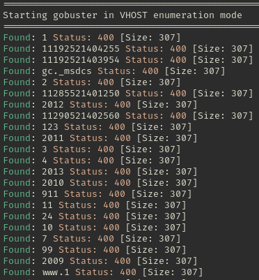

# TakeOver

> ⚠️ Spoiler warning! Do you want to try out the room yourself before you read further? You'll find it at [https://tryhackme.com/room/takeover](https://tryhackme.com/room/takeover)

## 📋 Introduction

This one got on my nerves. Pushed my buttons so to say. Drove me up the wall. Got under my skin. It set my teeth on edge. I think you get the picture, right? 😅 Especially since in was marked as *Easy* and was found in the category *5 minute hack*. I just started this CTF to have a quick little session. It didn't go down that way. It had me running in circles for quite some time, but it's a shame to give up (skam den som ger sig). The grit kept me going.

Here's the task instruction:
> Hello there,
>
>I am the CEO and one of the co-founders of futurevera.thm. In Futurevera, we believe that the future is in space. We do a lot of space research and write blogs about it. We used to help students with space questions, but we are rebuilding our support.
>
>Recently blackhat hackers approached us saying they could takeover and are asking us for a big ransom. Please help us to find what they can takeover.
>
>Our website is located at https://futurevera.thm
>
>Hint: Don't forget to add the MACHINE_IP in /etc/hosts for futurevera.thm ; )

## 🐱‍💻 Getting Started

After I added the IP in `/etc/hosts` I went to the website and had a look around. It was just a single page with no links or hidden flag, so I went down with the subdomain enumeration pretty quickly.

I ran **Gobuster** in a pretty standard way, `gobuster vhost -u https://futurevera.thm -w Documents/wordlists/DNS/subdomains-top1million-20000.txt --no-tls-validation`. The things standing out was `vhost` since the CTF domain wasn't in public DNS, and `--no-tls-validation` to make Gobuster ignore the self-signed certificate. 

I got a bunch of **Status 400** that didn't make any sense really. I wanted some more insights, so after some tweaking around without any great progress I switched to **Ffuf**.

**Ffuf** on the other hand gave me a lot of **Status 200** instead, on exactly every enumeration. This made me think the website was using some kind of catch all, pointing every invalid subdomain to **futurevera.thm**. 

Not very helpful either. The good thing is that you can filter out the results in several ways, with `-fs` in particular you can filter by size and that was what I did. It seemd like `4605` was my baseline, so I filtered that out and got two solid hits: `support` and `blog`.

I added `support.futurevera.thm` and `blog.futurevera.thm` to my hosts file and went to have a look. The support site was a one-pager saying that they were re-building the support website. The blog had a couple of pages, but there was no obvious flag. 

The hint for the CTF said
> This is an enumeration challenge, once you will find it, it will straight up give you the flag.

So I assumed that I was looking for a subdomain that, once found, would be suuuper obvious. The CTF was marked as **Easy** after all 😅

## 🤔💫 The Running Around in Circles Begins

Here is when I got deep on enumeration... I won't break it down in detail, mostly because I don't remember all the different ways and methods I tried, but to sum it up:

- I tried several wordlists for subdomain enumeration from **SecLists**.
- Tried curated lists, both with variants of `blog` and `support` (like `dev-support`, `staging-support`) and lists with a space theme (futurevera.thm was all about space).
- I did directory enumeration on the blog and support subdomains to try to find hidden pages.
- Tried second-level subdomain enumeration with several lists (like `staging.support.futurevera.thm`)
- Deep dived into the page sources to see if there was a hidden flag after all.

I was out of luck. The subdomain that interested me the most though was `support` since it said they were re-building it. Developing a new site increased the odds of finding some kind of staging site.

I didn't want to concede to a walkthrough, reading someone elses writeup. But I was really running low in ideas, so I had a little look in the `#room-help` channel on the TryHackMe Discord. I had been doing everything right, but the hint I needed was "check the certificates".

## 📜 Checking the Certificates

I headed over to my browser, went to `support.futurevera.thm` and clicked my way to check the certificate.

Scolling down I saw the heading **Subject Alt Names** with the fantastic DNS name of `secrethelpdesk934752.support.futurevera.thm`. No wonder my wordlists didn't catch that one 😅

I added it to my hosts file and checked it out in my browser. At first I got a bit worried/shocked/anxious because the first thing I read was **Hmm. We're having trouble...** But I continued to read and found the flag. Finally 🚩

## 📝🛠️ Conclusion and Key Takeaways

This "easy" task learned me a lot about subdomain (and directory) enumeration. Especially how I can tweak my Gobuster and Ffuf commands to my benefit. Such cool and powerful tools! I'm amazed. 

I'm a bit disappointed that the task instruction said that the flag was going to be pretty straight forward to find - it really wasn't for me. But I guess checking the certificates **is** a straight forward move in the world of CTFs, so that's something I've learned for the future. In summary:

📌 Grit is always rewarded in the end.  
📌 A helpful hint can be super useful.  
📌 Improved my Gobuster and Ffuf skills.  
📌 Remember to think outside the box.  
📌 Approx time to finish? Don't even ask 😅

Thanks for reading and happy hacking ✨