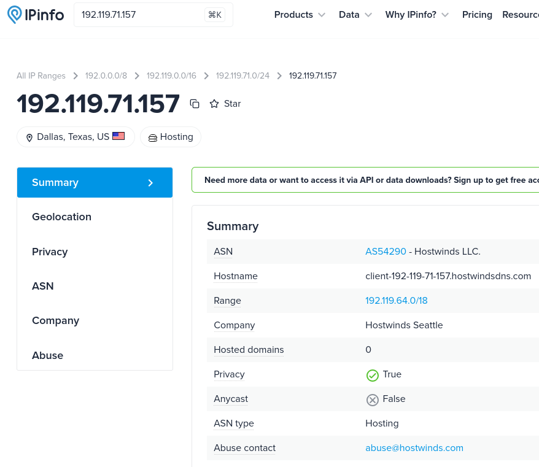
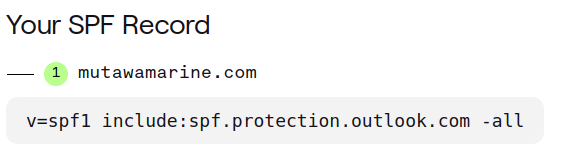
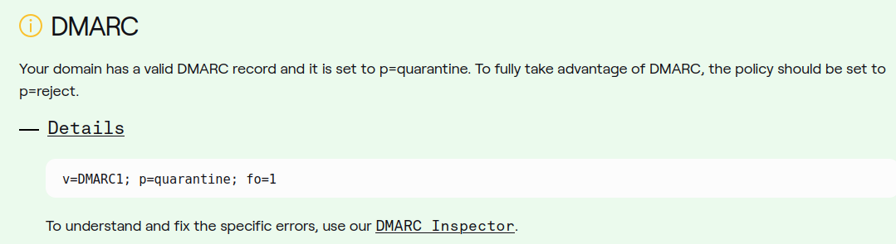
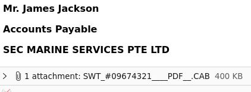
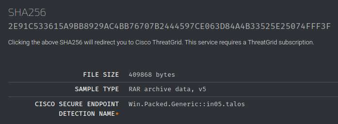
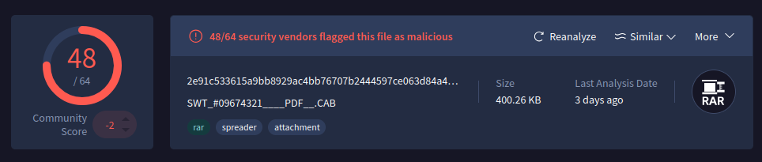

# The Greenholt Phish

https://tryhackme.com/room/phishingemails5fgjlzxc

(English writeup found [here](English_version).)

## Introduktion

Det här är första gången jag tar mig an en blå utmaning på TryHackMe. Uppgiften går ut på att analysera ett misstänkt phishing-mail som har skickats till en Sales Executive på Greenholt PLC. Eftersom jag har en del erfarenhet av att undersöka PCAP-filer från FRA:s utmaningar så tänker jag att det borde rulla på ganska bra. Att leta igenom email-headers borde vara ungefär samma.

Uppgiften består av 12 frågor, alla kopplade till det aktuella mailet. (För säkerhets skull har jag "defanged" alla länkar och mailadresser från uppgiften)

## Fråga 1

What is the Transfer Reference Number listed in the email's subject? `09674321`

## Fråga 2

Who is the email from? `Mr. James Jackson`

## Fråga 3

What is his email address? `info[@]mutawamarine[.]com`

## Fråga 4

What email address will receive a reply to this email? `info[.]mutawamarine[@]mail[.]com`

## Fråga 5
What is the Originating IP? Dags att kolla headers.

Svaret är `192[.]119[.]71[.]157`

## Fråga 6

Who is the owner of the Originating IP?

Jag kollade upp det på IPinfo

Svaret är `Hostwinds LLC`

## Fråga 7

What is the SPF record for the Return-Path domain?

Detta kollade jag upp på [dmarcian.com](img/https://dmarcian.com)

Svaret är alltså `v=spf1 include:spf.protection.outlook.com -all`

## Fråga 8

What is the DMARC record for the Return-Path domain?

Detta kollade jag på samma site

Svaret är `v=DMARC1; p=quarantine; fo=1`

## Fråga 9

What is the name of the attachment?

Svaret är `SWT_#09674321___PDF__.CAB`

## Fråga 10

What is the SHA256 hash of the file attachment?

För att svara på det behövde jag ladda ner den bifogade filen, men givetvis utan att öppna den. Jag använde `sha256sum` i terminalen och fick hashen `2e91c533615a9bb8929ac4bb76707b2444597ce063d84a4b33525e25074fff3f`

## Fråga 11

What is the attachments file size?

Jag körde en enkel `ls -l` i terminalen för att få filstorleken, men uppgiften ville att jag skulle jämföra hashen mot en databas. Jag vände mig till **Talos File Reputation**. Det funkade ju fint, men jag fick samma storlek på filen.

Det visade sig att uppgiften inte nöjde sig med vad **Talos** kom fram till, så jag kollade upp hashen på **VirusTotal** som gav mig svaret `400.26 KB`

## Fråga 12

What is the actual file extension of the attachment?

När jag hade laddat ner den såg det ut som en zip-fil. **Talos File Reputation** avslöjade att det var en rar-fil. Svaret är alltså `rar`

## Slutord

En trevlig challenge som fick mig att bli mer bekväm i att leta information bland email-headers och även använda några verktyg på nätet för att kolla upp en misstänkt fil. Inte på långa vägar så utmanande som de röda rummen jag tidigare tagit mig igenom, men jag ser fram emot att möta fler blåa utmaningar framöver! Jag misstänker att det kan bli mycket klurigare.

> Skriven och publicerad av mig 2025-11-25