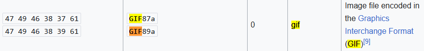
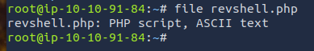
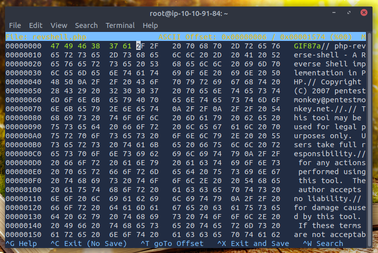
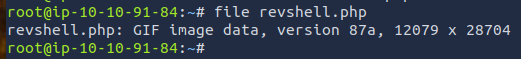
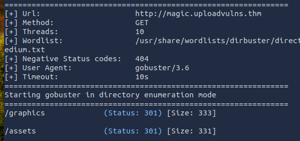
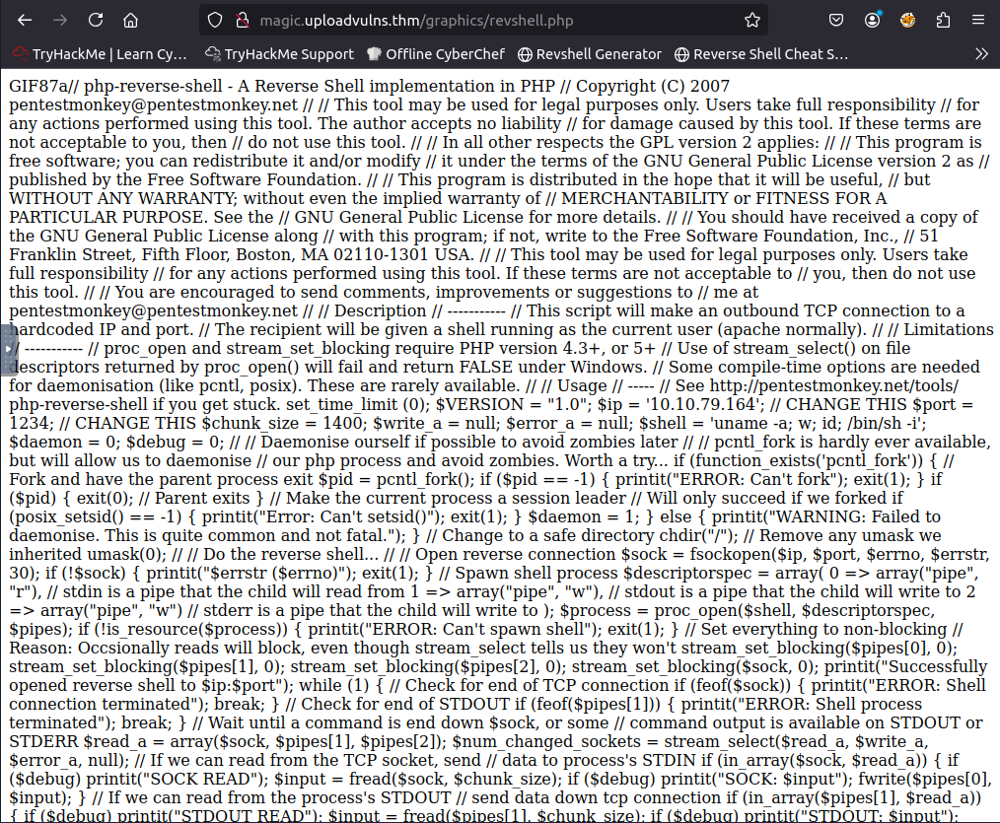
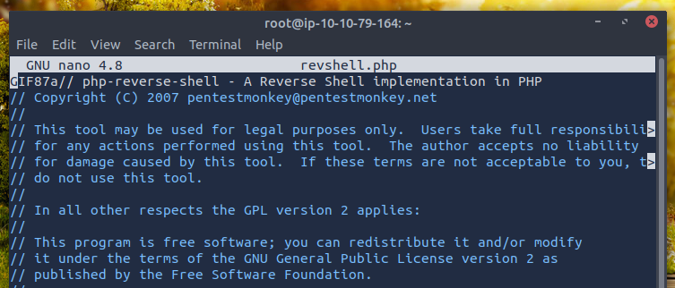
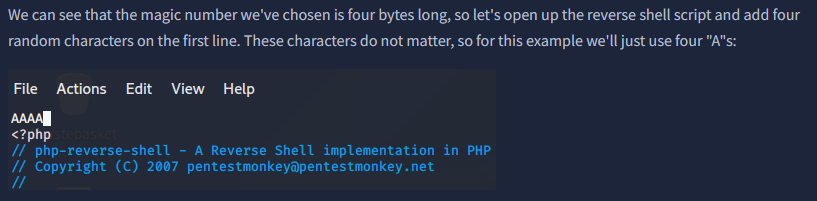
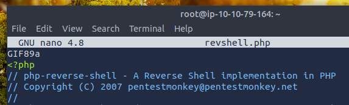
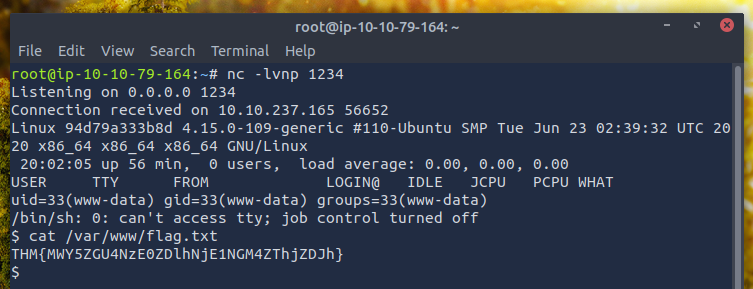

# Upload Vulnerabilities, task 9
### Bypassing Server-Side Filtering: Magic Numbers
#### *2025-07-29*

> ⚠️ This writeup contains spoilers for the room *Upload Vulnerabilities* on Try Hack Me. I highly recommend trying the room yourself before reading further! You can find it at [https://tryhackme.com/rooms/uploadvulns](https://tryhackme.com/rooms/uploadvulns)

## 📋 Introduction

This room's all about finding vulnerabilities which allow us to upload stuff to web servers. Stuff that shouldn't be on the server so to say. Like a reverse shell for instance. 

To prevent such files to be uploaded there should be some kind of filter in place. These filters can work either on the client-side or server-side, where the client-side ones are considered insecure since you have all means possible to alter them. The filter is on your computer after all. 

This is why server-side filtering is the way to go! But if it is a weak type of filter, or if it's incorrectly implemented, there can be som pretty big vulnerabilities to exploit.  

This is a walkthrough task which introduced me to alter the "magic number" of a file to bypass the filter. So, the filter doesn't care if the file extension is `.jpg` or `.php`, it takes a look at the very first bytes of the file which is called the *file signature*. Or, as it's also known as: the `magic numbers` ✨

The thing is, I was actually shown in the tutorial how to alter the magic numbers, but I didn't fully understand *why* they did one of the steps, so I thought I could cut a corner a do it a bit faster. I'll show you why that didn't work from the start, and how I figured out what was wrong.

Oh, and before starting. The room requires that you edit the `hosts` file on your system to access the webpages. Add the following line:
```
SERVER/MACHINE_IP    overwrite.uploadvulns.thm shell.uploadvulns.thm java.uploadvulns.thm annex.uploadvulns.thm magic.uploadvulns.thm jewel.uploadvulns.thm demo.uploadvulns.thm
```

## 🔍 Let's get going

Heading over to `magic.uploadvulns.thm` there is, as expected, an upload page. 


Since there are no instructions for what file types that are allowed to upload I'll try with a `.jpg` file that I have been able to use in the previous tasks. Doing that gave me the following message:


Alright, that's something. Now that I know what file type is allowed I need to do the following:

- Find out the magic numbers for `.gif`.
- Alter the magic numbers of my php-file.
- Run Gobuster to find out where the uploaded files are stored.
- Upload the script and run it.
- Get the flag.

## 🔮 Altering the Magic Numbers

First of all I need to know the magic numbers of a `.gif`. Luckily there is a fenomenal page on [Wikipedia](https://en.wikipedia.org/wiki/List_of_file_signatures) having exactly that.



Now let's do a quick rundown to see what file type my php-file is right now so that we can check if I get the expected result after altering the magic numbers. (Btw, I downloaded the [Pentest Monkey](https://raw.githubusercontent.com/pentestmonkey/php-reverse-shell/master/php-reverse-shell.php) reverse shell. That's the one I have been using throughout the whole room.) Running `file` I see that the file is indeed a php script.



Time to edit the magic numbers. I installed and used `hexeditor` for that.



⚠️ ⚠️ ⚠️ This is where I did a mistake when trying to cut some corners. Can you see why? I'll get back to it later. ⚠️ ⚠️ ⚠️

Running `file` again show me that the file now is interpreted as a gif-file instead of a php-file. Exactly what I wanted.



So the script should be good to go. But before I upload it I need to find out where the uploaded files are stored. No point in uploading a script without being able to access it.

## 📂 Finding the Directory

This is where the neat program Gobuster comes into the picture. With Gobuster I'll specify the target URL and a wordlist, and Gobuster will enumerate every path based on the wordlist. The command looks like this `gobuster dir -u http://magic.uploadvulns.thm -w '/path/to/your/wordlist.txt'` and gave me the following output.



I only let Gobuster run for a short while because I assumed the uploaded content will either be found at `/graphics` or `/assets`. Those file paths sound good enough to try for a start, so let's head over and upload and run the script.

## 📡 Uploading and Running the Script

The modified script, camouflaged as a `.gif`, fooled the server-side filter and was uploaded to the server without any issues. Sweet!


Since it's a reverse shell I needed to start `netcat` listening for the incoming connection, so I opened a new tab in the terminal and ran `nc -lvnp 1234`

Now let's run the script. The `/graphics` path seemed most interesting so I headed there first `http://magic.uploadvulns.thm/graphics/revshell.php`. And it was somewhat a success, but not really.



It seemed like I chose the right path as I could see my uploaded script. But it didn't execute. Hmm... 🤔 As you might understand, this is the part where the effects of me trying to cut some corners come into play.

I thought to myself that maybe I chose the magic numbers for the wrong kind of gif. The Wikipedia page did mention two types of gifs, the `GIF87a` (which was the one I tried) and `GIF89a`. I don't really know the difference between them, but it was worth a try. So I edited the `revshell.php` so it started with the magic numbers corresponding to `GIF89a`. The result? Same, it made no difference.

I opened `revshell.php` in `nano` to have a closer look, and that was when I realised why it didn't work.



In the tutorial, they added a couple of characters in the beginning of the script, equivalent to the lenght of the magic numbers they wanted to alter. This was the part I didn't understand why, which also made me skip that step of the process.



Now I realise that since I never added any charachters in the beginning of the script, when I changed the first bytes I overwrote the beginning, i.e. erasing the opening php tag 🤦‍♂️ Adding the `<?php` tag again made it look much better.



Re-uploading and heading over to the URL again. Everything worked as a charm, netcat caught the incoming connection and there was the reverse shell. I headed over to `/var/www/flag.txt` as said in the instructions, and there was my flag 🏳‍🌈



## 📌 Conclusion

This task taught me what the `magic numbers` of a file are and how they can be altered to bypass a server-side filter when uploading files. I also got some hands-on practice in figuring out why my script didn't work from the start. 

I skipped a step in the tutorial because I didn't understand the reason of doing it, then I faced another challenge because of that. Thanks to this little re-route I think I learned more about magic numbers than what I would have done in the first place.

Thanks for reading and happy hacking ✨


